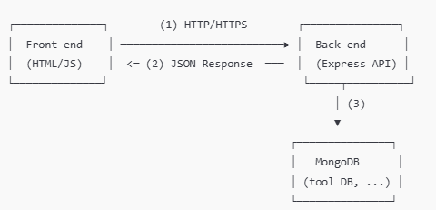

# 安裝與執行指引

## 開發環境

我的開發環境包含前端使用 **React** 和 **TypeScript**，後端開發則採用 **Node.js** 和 **Express**，資料庫選擇 **MongoDB**，API 測試使用 **PostMan**，並且通過 **npm** 進行套件安裝。

---

## 架構圖


---

## 流程圖：描述 CRUD 功能的操作流程

> （此處先不放圖片，僅文字簡述）

1. **使用者操作與請求**  
   使用者透過瀏覽器或應用程式與前端互動，例如點擊按鈕、提交表單或請求資料。前端透過 HTTP 請求將需求傳送至後端伺服器的 API。

2. **後端接收請求**  
   後端伺服器接收到請求後，將其轉交至對應的路由或控制器。後端會進行請求的驗證，並與資料庫進行溝通，例如查詢、修改或新增資料。

3. **後端回傳資料**  
   後端將處理後的結果打包為 HTTP 回應（通常是 JSON 格式），並回傳給前端。

4. **前端接收並顯示資料**  
   前端接收到後端回傳的資料後，進行資料解析並更新畫面，將最終結果呈現給使用者。

---

## API 規格說明文件

以下列出常見的 CRUD 功能，各路由、HTTP 方法、參數與範例回應。

### 1. 取得所有與單筆工具 (同 GET)

- **Method**: `GET`
- **路由**:  
  - `/api/v1/tool` (取得所有工具)  
  - `/api/v1/tool/:id` (取得單筆工具，需傳入工具的 `_id`)
- **範例回應 (JSON)**:

  - **取得所有 (GET /api/v1/tool)**  
    ```json
    {
      "message": "取得工具清單成功",
      "tools": [
        {
          "_id": "64f7a03da8c439acf5c3ef76",
          "name": "Hammer",
          "quantity": 10,
          "type": "hand tool",
          "price": 150,
          "location": "Taipei"
        },
        {
          "_id": "64f7a044a8c439acf5c3ef77",
          "name": "Saw",
          "quantity": 25,
          "type": "hand tool",
          "price": 450,
          "location": "Taipei"
        }
      ]
    }
    ```
  - **取得單筆 (GET /api/v1/tool/:id)**  
    ```json
    {
      "_id": "64f7a03da8c439acf5c3ef76",
      "name": "Hammer",
      "quantity": 10,
      "type": "hand tool",
      "price": 150,
      "location": "Taipei"
    }
    ```

### 2. 新增工具 (Create Tool)

- **Method**: `POST`
- **URL**: `/api/v1/tool`
- **Request Body (JSON)**:
  ```json
  {
    "name": "Hammer",
    "quantity": 10,
    "type": "hand tool",
    "price": 150,
    "location": "Taipei"
  }
- **範例回應 (JSON)**:

  {
  "message": "新增工具成功",
  "tool": {
    "_id": "64f8b20fa56be4324fb3d710",
    "name": "Hammer",
    "quantity": 10,
    "type": "hand tool",
    "price": 150,
    "location": "Taipei"
  }

}

### 3. 修改工具 (Update Tool)

- **Method**: `PUT`
- **URL**: `/api/v1/tool`
- **Request Body (JSON)**:
  ```json
  {
  "price": 200,
  "quantity": 30
}

- **範例回應 (JSON)**:

  {
  "_id": "64f8b20fa56be4324fb3d710",
  "name": "Hammer",
  "quantity": 30,
  "type": "hand tool",
  "price": 200
}

### 4. 刪除工具 (Delete Tool)

- **Method**: `DELETE`
- **URL**: `/api/v1/tool/:id`

- **範例回應 (JSON)**:

  {
  "message": "刪除成功"
}
